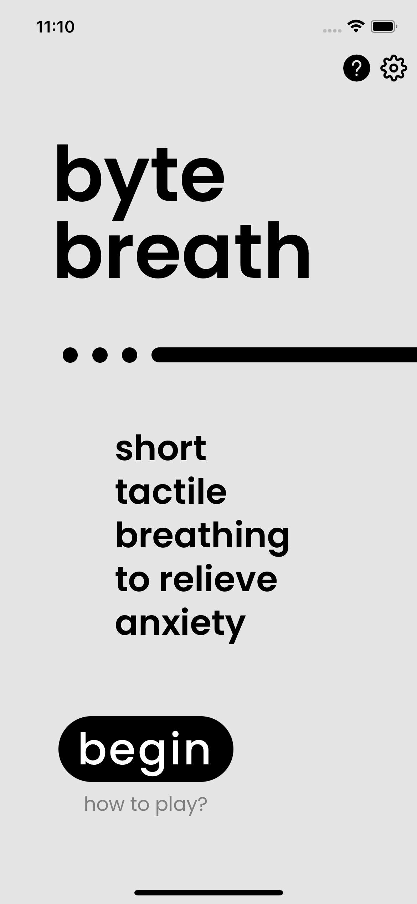
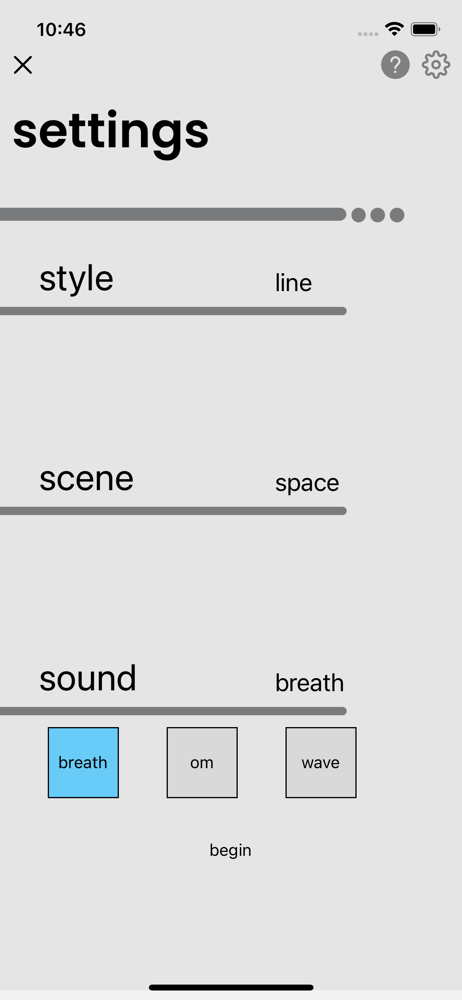
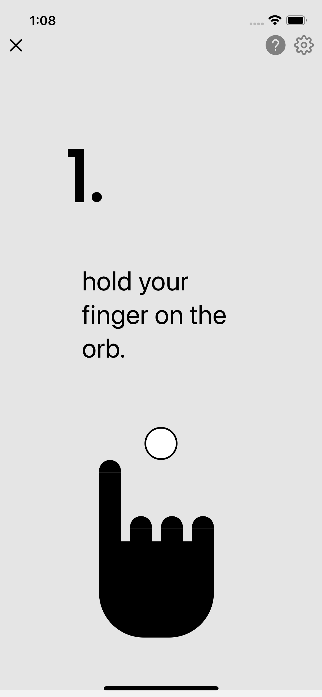
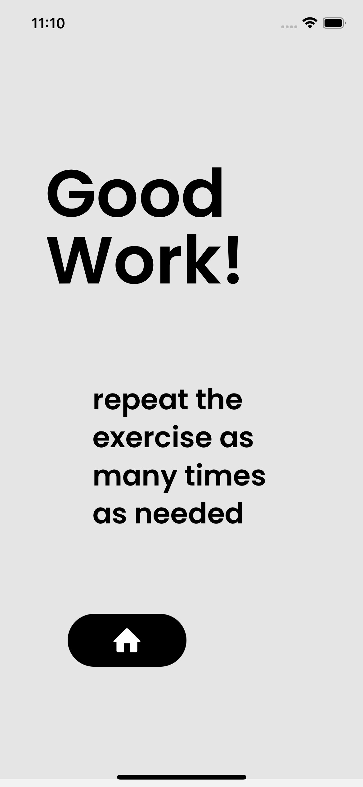

# Byte Breath
A multi-sensory assisted meditation app. The goal is to keep the user engaged for five breaths using touch and sound as anchors. 

# App Screenshots








# Get started

1. Clone this repository 

2. Install dependencies

   ```bash
    npx expo install
   ```
3. Start the app

   ```bash
    npx expo start
   ```
-- you will need to make a development build or run in development mode as Superwall does not work in Expo GO

In the output, you'll find options to open the app in a

- [development build](https://docs.expo.dev/develop/development-builds/introduction/)
- [Android emulator](https://docs.expo.dev/workflow/android-studio-emulator/)
- [iOS simulator](https://docs.expo.dev/workflow/ios-simulator/)
- [Expo Go](https://expo.dev/go), a limited sandbox for trying out app development with Expo

You can start developing by editing the files inside the **app** directory. This project uses [file-based routing](https://docs.expo.dev/router/introduction).

